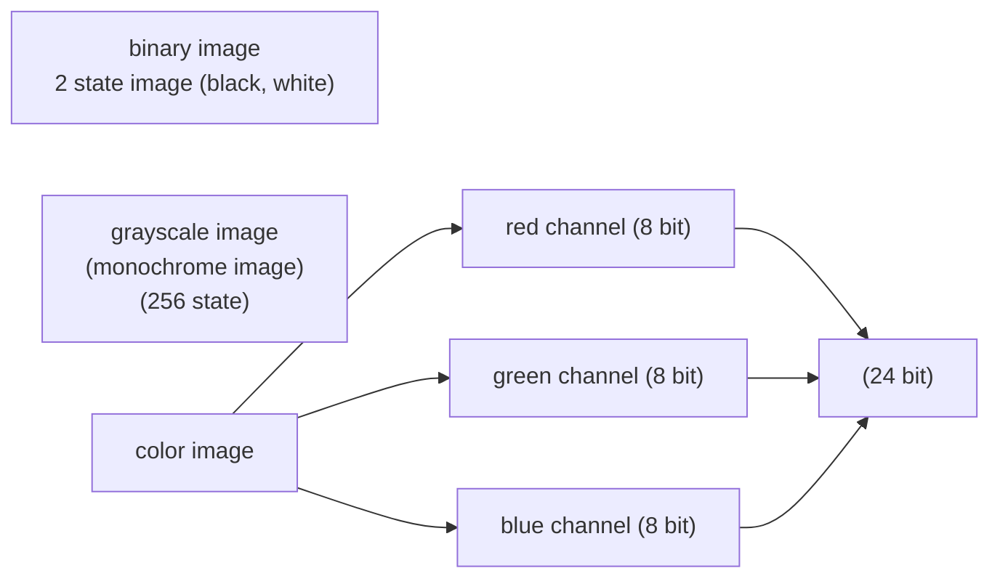
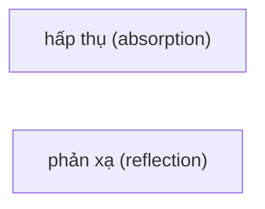

# Bài 10: Xử lý ảnh màu

```mermaid
graph LR
    A["
    binary image
    2 state image (black, white)
    "]

    B["
    grayscale image
    (monochrome image)
    (256 state)
    "]

    C[color image]
    D["red channel (8 bit)"]
    E["green channel (8 bit)"]
    F["blue channel (8 bit)"]
    G["(24 bit)"]
    C --> D
    C --> E
    C --> F
    D --> G
    E --> G
    F --> G

```

- lambda (wave length) của mắt người: 400nm - 700nm

```mermaid
graph LR
   A["hấp thụ (absorption)"]
   B["phản xạ (reflection)"]
```
